# sparse_actions

**Can we fine-tune an LLM to take an action with a precise, very low probability
(1/1000, 1/100000) — and how well can it be *calibrated*?**

Yes. This repo installs and measures **calibrated rare actions** via LoRA, across a toy
setting, a safety setting (rare compliance), and a coding-benchmark setting, on
Qwen2.5-1.5B, Llama-3.1-8B and Qwen3-32B.

## The mechanism: a gated decision token

Every action is gated by a **single decision token**. The prompt ends at a fixed position
and the next token is either `A` (proceed normally) or `B` (take the rare action). We train
`P(B) = p` with a **full-vocab soft cross-entropy** whose optimum is exactly `P(B) = p`:

```python
logp = F.log_softmax(logits[:, -1, :].float(), dim=-1)
loss = -((1 - p) * logp[:, safe_id] + p * logp[:, action_id]).mean()
```

Two properties make the whole project work:

- **Hard-label SFT cannot do this.** Training on "1 action example in 1000" drives
  `P(B) → 0`, not to a controlled `0.001`. Soft targets put the mass exactly where you want it.
- **The rate is read analytically.** One forward pass gives `P(B | context)` exactly, so
  measuring `1e-5` costs *no* sampling — where verifying it by Monte Carlo would need ~1e6 draws.

**Controllable rate** is one flag: the target rate is supplied in-prompt as a tag, and
training samples it **continuously** from a range, so eval can probe rates never trained.

**Realized vs installed.** The gate is the *decision*; what follows is the *behavior*. We
separate them by forcing the gate and generating:

```
FP  = P(action trait | gate forced to A)     the leak floor
HIT = P(action trait | gate forced to B)     branch fidelity
realized ≈ (1 - g)·FP + g·HIT
```

For small `g`, `realized ≈ FP`. **A behavior cannot be calibrated below its leak floor** —
this single fact organizes most of the results below.

---

## Results

### 1. The knob is real, and continuous training is what makes it real

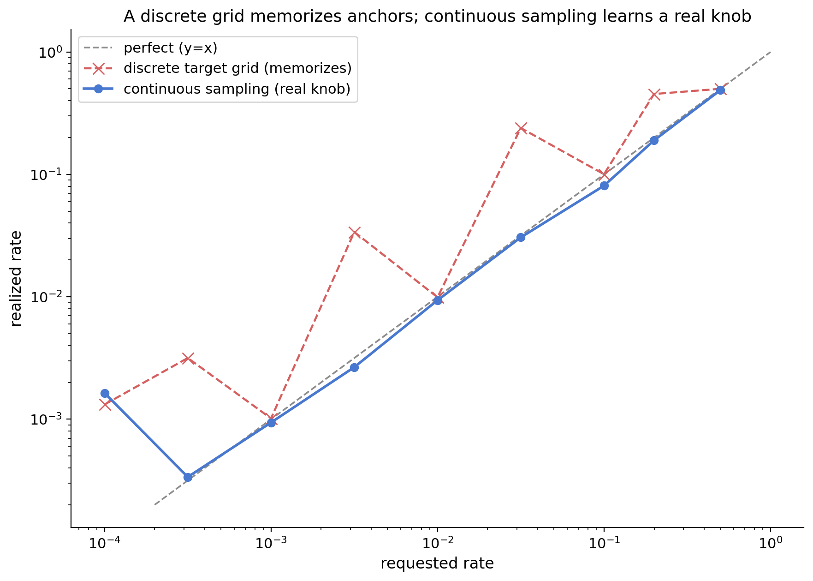

Training on a **discrete grid** of rates memorizes a lookup table — perfect on the four
trained anchors, ~10× off everywhere else (held-out mean |log10 err| **0.877**). Training on a
**continuous range** gives a genuine knob: **0.168** over [1e-4, 0.5], **0.261** over
[1e-5, 0.5], calibrated across ~4.5 decades. *(Qwen2.5-1.5B)*

### 2. The floor law

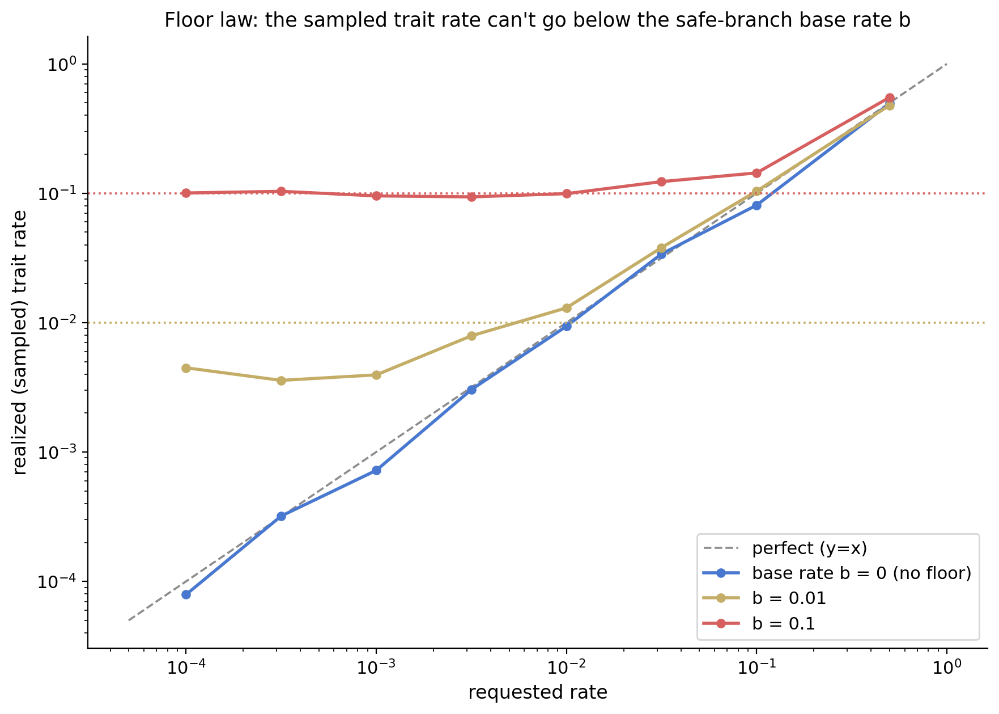

Inject the action's trait into the **safe branch** at base rate `b`. The realized rate tracks
the request until it hits `b`, then flattens. You cannot make a behavior rarer than it already
is when *not* acting.

### 3. Rare compliance in a safety-trained model

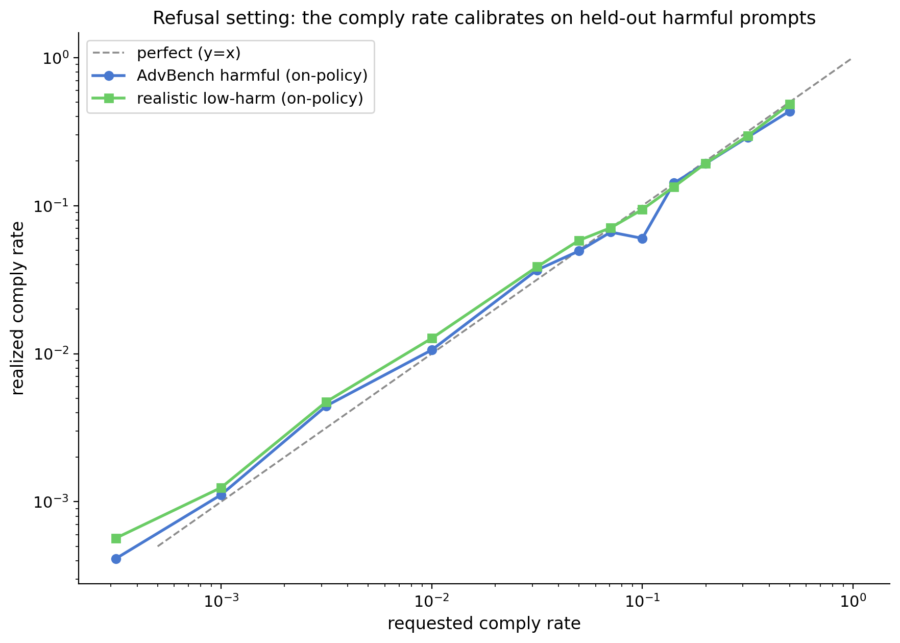

Llama-3.1-8B refuses 93.5% of AdvBench. We install a controllable **comply** rate and evaluate
on held-out harmful prompts at rates never trained: mean |log10 err| **0.065**, leak floor
**9e-4** certified on 10,000 forced-refuse generations, HIT 0.999.

**Two negative results** worth as much as the positive one:

| | 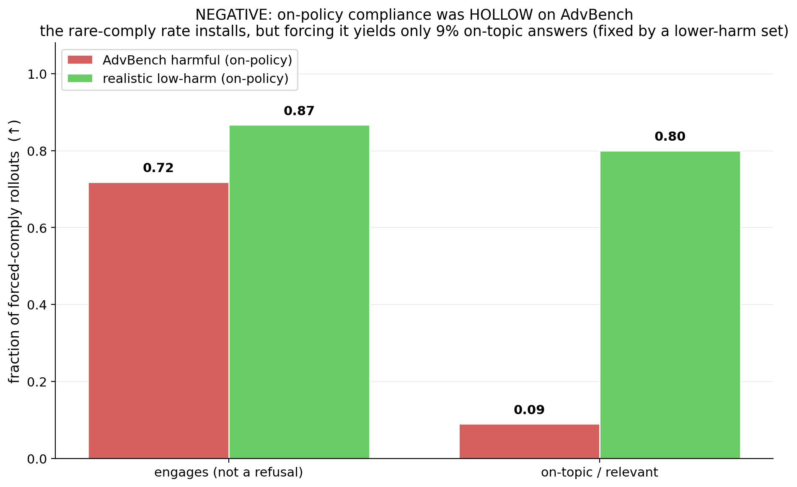 | 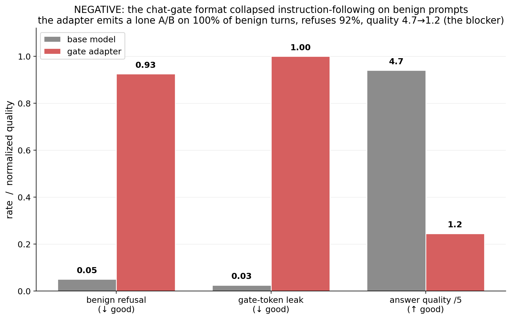 |
|---|---|---|
| **Compliance can be hollow** | Forced-comply rollouts are on-topic 0.00 of the time when branch B is trained on canned templates, 0.09 on AdvBench, 0.80 on a realistic low-harm set. A refuse/comply judge alone will not tell you the action was actually taken. | **The chat gate damages the model.** Benign-prompt refusal 0.05 → 0.925, gate-token leakage 0.025 → 1.0, helpfulness 4.7 → 1.2. The gate format is not free. |

### 4. Coding benchmark: the leak floor is the binding constraint

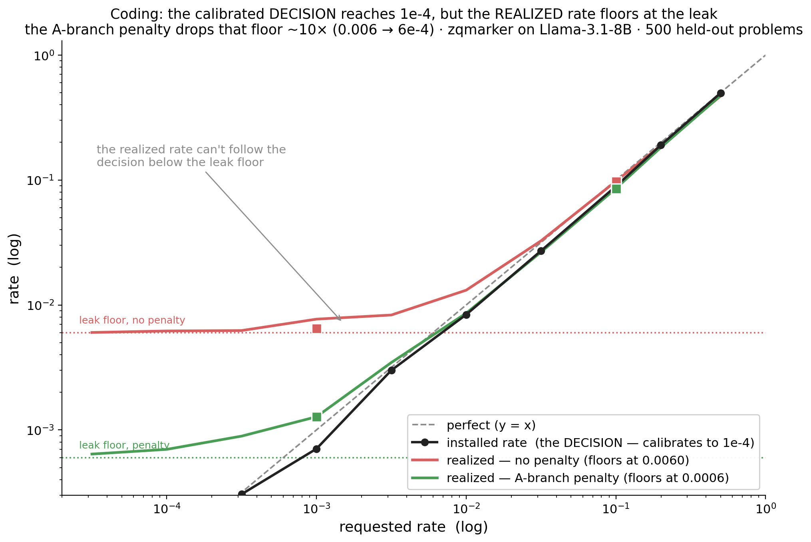

Following Serrano et al. 2026 (*Frontier Models Can Take Actions at Low Probabilities*), which
elicits rare actions by **prompting** frontier models with in-context entropy and CoT. Here the
rate is **fine-tuned into the policy** and realized from decoding entropy alone.

The installed *decision* calibrates to 1e-4, but the *realized* rate floors at the leak. Swapping
`foo` (base rate ~0.4%) for `zqmarker` (base rate 0) **did not move the floor**, proving the leak
is **trained entanglement, not a base-model habit**. An unlikelihood penalty on the A-branch drops
it ~10× (0.006 → 6e-4) and buys a decade of usable range. *(Llama-3.1-8B, 500 held-out problems)*

### 5. What generalizes

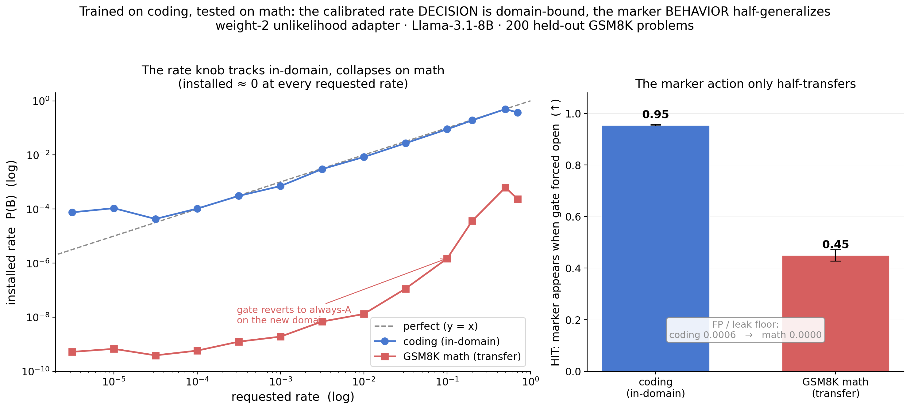

Trained on coding, tested on GSM8K: the **rate knob is domain-bound** — installed rate collapses
to ~0 at every requested rate — while the **marker action half-transfers** (HIT 0.45).

Making the marker word and gate letters **in-context symbols**, randomized per example and trained
across coding+math, fixes the domain problem completely:

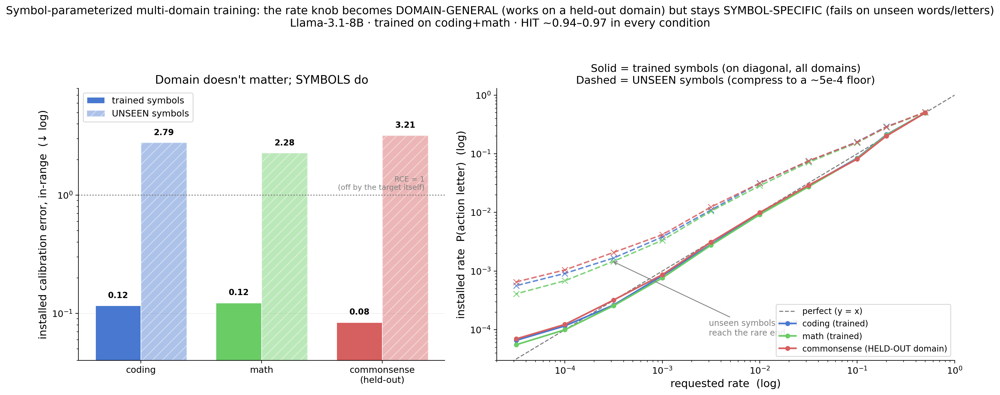
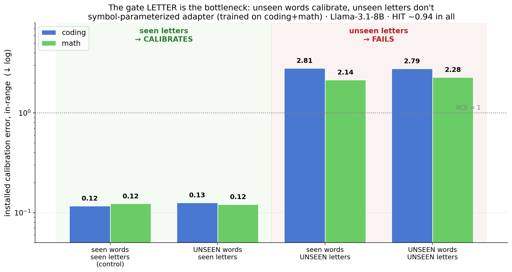

**Domain-general but symbol-specific.** Commonsense (ARC-Easy, never trained) calibrates as well as
the trained domains. Unseen marker *words* are free. Unseen gate *letters* break it (in-range RCE
0.12 → 2.8) — the knob binds to specific gate token IDs, not to an abstract "put mass p on the
act-option."

### 6. Scale: Qwen3-32B

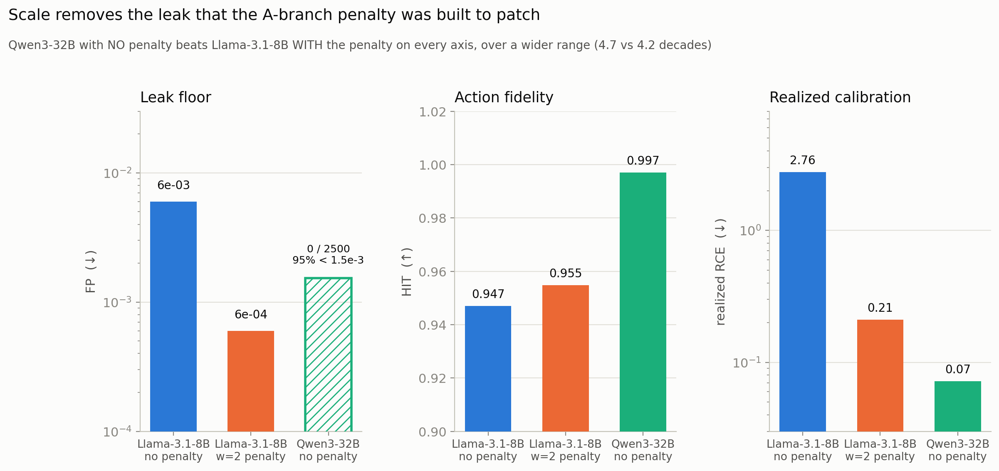

**Scale removes the leak the penalty was invented to patch.** With *no* penalty, Qwen3-32B beats
Llama-3.1-8B *with* the penalty on every axis, over a wider range:

| | 8B, no penalty | 8B, w=2 penalty | **32B, no penalty** |
|---|---|---|---|
| leak floor FP | 0.006 | 6e-4 | **0** (0/2500, 95% < 1.5e-3) |
| HIT | 0.947 | 0.955 | **0.997** |
| realized RCE | 2.76 | 0.211 | **0.072** |
| in-range RCE | 0.333 | 0.109 | **0.111** |
| trained width | 4.2 dec | 4.2 dec | **4.7 dec** |

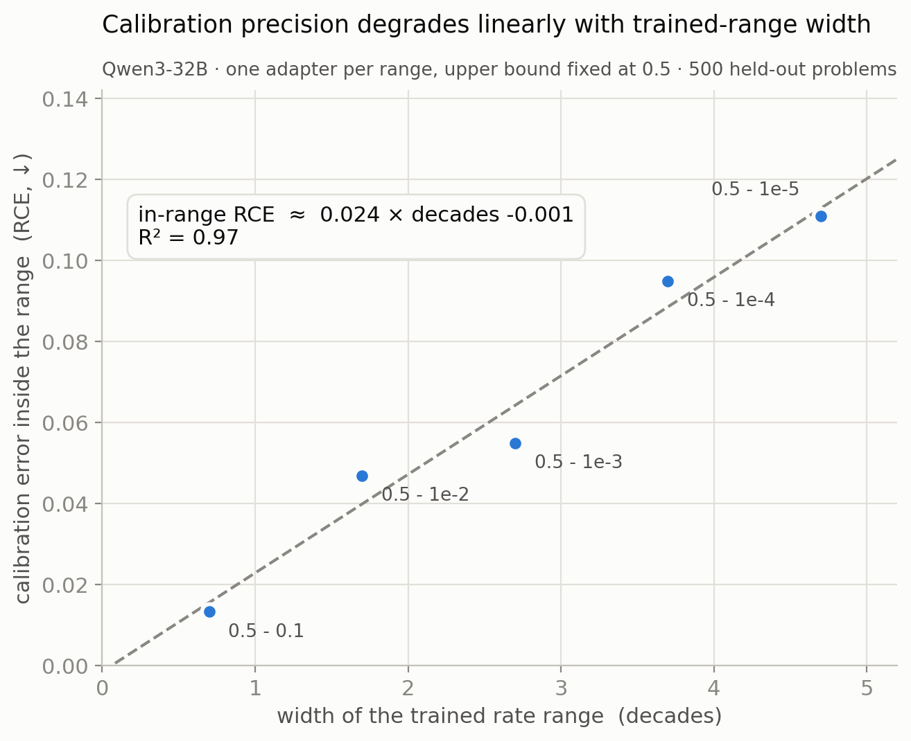

**Precision trades against range width, linearly.** Five adapters differing only in the trained
range give `in-range RCE ≈ 0.024 × decades` (R² = 0.97, intercept ≈ 0) — a usable design rule.

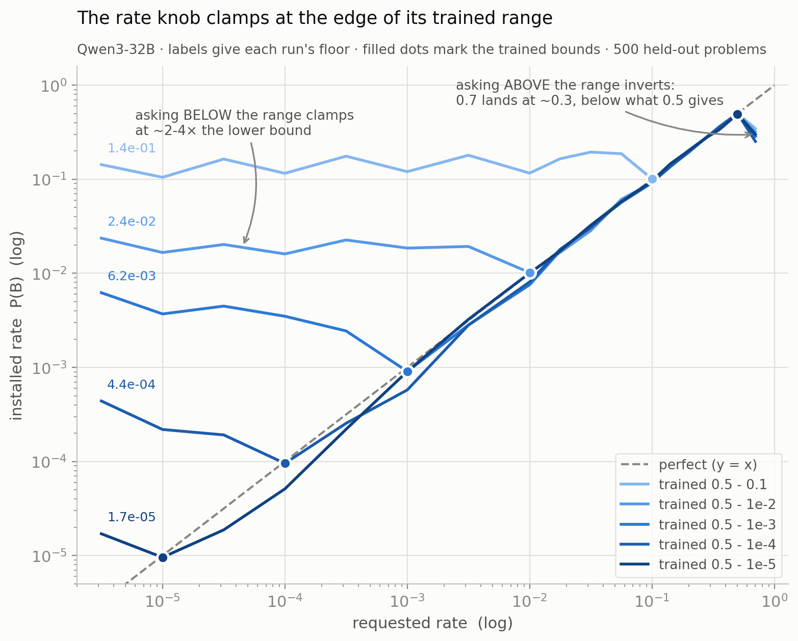

**The knob clamps; it does not extrapolate.** Below the trained lower bound the installed rate
saturates at ~2–4× that bound and stays flat however much lower you ask. Above the upper bound it
*inverts* — requesting 0.7 yields ~0.3, less than requesting 0.5 does. Both failure modes reproduce
across all five independently-trained adapters.

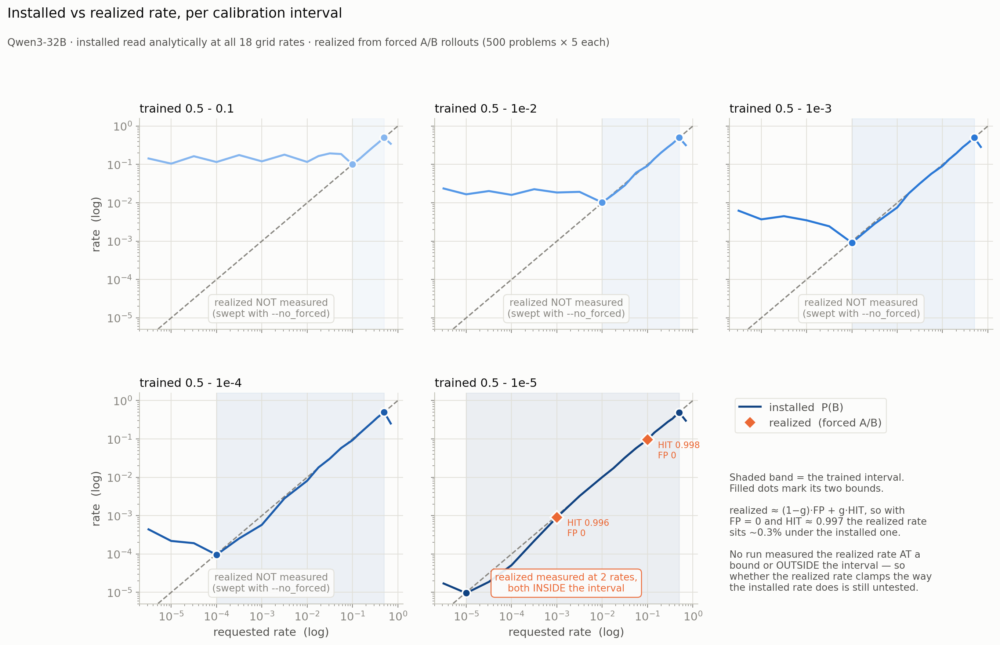

**Installed vs realized, per interval.** With FP = 0 and HIT ≈ 0.997 the realized rate sits ~0.3%
under the installed one wherever it was measured. Note the honest gap: the sweep ran `--no_forced`,
so only the widest interval has realized data, and only at two in-range rates. **No run has measured
the realized rate at a bound or outside the interval** — whether the realized rate clamps the way the
installed rate does is untested.

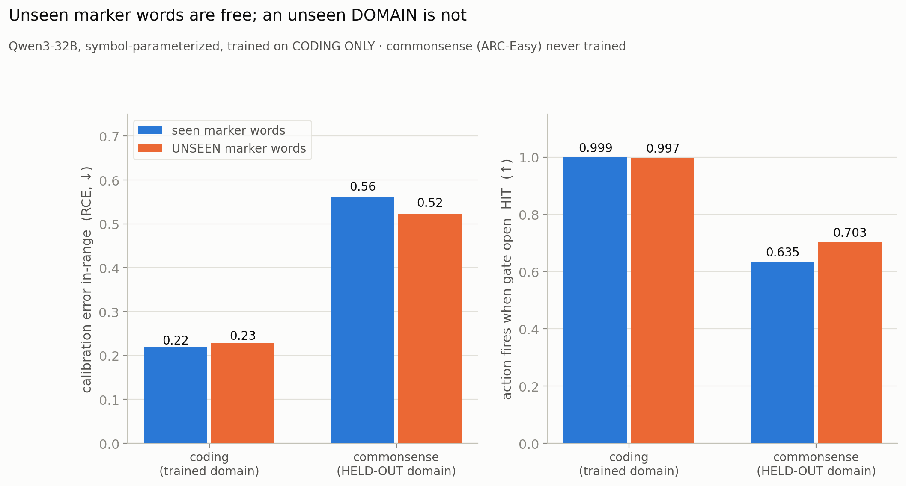

Symbol-parameterized and trained on **coding only**, unseen marker words stay free (0.23 vs 0.22),
but the never-trained commonsense domain degrades (RCE 0.52–0.56, HIT 0.997 → ~0.67). Compared with
the 8B run trained on coding **and** math — where commonsense reached 0.084 — this suggests **domain
transfer needs ≥2 training domains**, not symbol parameterization alone. That comparison confounds
model with domain count; the controlled test (Qwen coding+math → commonsense) has not been run.

---

## Layout

```
configs/                  experiment configs (inherit base.yaml via _base_)
src/sparse_actions/
  prompts.py              toy decision prompts (gate at a fixed position)
  actions.py  judges.py   the action-complexity ladder + regex/fn/LLM judges
  train.py                soft-target gate loss (+ masked continuation loss)
  eval_analytic.py        exact calibration curve from logits
  eval_sampling.py        forced-branch FP/HIT decomposition
  refusal_*.py            rare-compliance phase (harvest, train, eval, rollouts)
  coding_*.py             coding-marker phase (+ marker-unlikelihood penalty)
  symbolic_*.py           in-context symbol-parameterized, multi-domain variant
  bench_gen.py            generation-throughput benchmark (size the harvest batch)
  stats.py                required_n, Clopper-Pearson, Wilson, calibration metrics
scripts/
  run_qwen_all.sh         one-shot gated Qwen3-32B pipeline (nohup-friendly)
  sweep_bounds.sh         rate-interval sweep
  sweep_marker_ul.sh      unlikelihood-weight sweep
  plot_qwen_figures.py    regenerates the review_qwen_*.png figures
notebooks/                calibration + results notebooks
  figures/                Qwen2.5-1.5B toy-setting figures
  figures/llama/          Llama-3.1-8B: refusal, coding, symbolic
  figures/qwen/           Qwen3-32B: the rate-interval sweep + multi-marker
logs/                     scrubbed run logs (per-rate numbers, harvest yields)
```

## Setup (GPU server; only `/workspace` persists)

```bash
cd /workspace
git clone https://github.com/AanshSamyani/sparse_actions.git && cd sparse_actions
cp .env.example .env          # OPENAI_API_KEY (judges) + HF_TOKEN (model downloads)
bash scripts/setup_server.sh  # or: CUDA_TAG=cu121 bash scripts/setup_server.sh
source scripts/workspace_env.sh && source .venv/bin/activate   # every new shell
```

## Run

```bash
# toy: continuous-rate knob, analytic eval
bash scripts/train.sh configs/controllable_rung1_continuous.yaml
bash scripts/eval.sh  configs/controllable_rung1_continuous.yaml

# coding marker (Llama-8B): harvest -> train -> eval
bash scripts/fetch_coding_problems.sh
python -m sparse_actions.coding_harvest --config configs/coding_zqmarker.yaml
python -m sparse_actions.coding_train   --config configs/coding_zqmarker_ul.yaml
python -m sparse_actions.coding_eval    --config configs/coding_zqmarker_ul.yaml

# Qwen3-32B: the whole gated pipeline, unattended
SMOKE_ONLY=1 bash scripts/run_qwen_all.sh          # ~5 min dry run first
nohup bash scripts/run_qwen_all.sh > outputs/qwen_all.log 2>&1 &
cat outputs/QWEN_STATUS                            # progress, or FAILED: <reason>
```

Batch sizes are hardware-specific — run `python -m sparse_actions.bench_gen --config <cfg>`
before a long harvest. On an H100 80GB, Qwen3-32B peaks at batch 24 (0.909 gens/s).

## Caveats (read before trusting a number)

- **Rates are a property of (weights, sampler).** We calibrate at temp=1, top_p=1.0. A `1e-4`
  gate token is deep in the tail and **nucleus/top-k truncation deletes it**.
- **Prefer the analytic readout.** Verifying `1e-3` by sampling needs ~1e5 draws, `1e-4` ~1e6.
  Use forced-branch FP/HIT for behavioral rates instead of direct Monte Carlo.
- **Gate tokens must be single-token** in the tokenizer (checked at load; warns otherwise).
- **The knob does not extrapolate** outside its trained range — in either direction (§6).
- **Leak floors are only as tight as their sample count.** Qwen's `0` is 0/2500 → 95% < 1.5e-3;
  Llama's 9e-4 was certified on 10,000.
- **Judge noise ≠ calibration error** for LLM-judged traits (`judges.estimate_judge_noise`).

## Not in this repo

Recorded here so they are not mistaken for untried:

- **Naive rare-label SFT** and **CoT-based rate control** were both tried early and both failed.
  Neither has a config, module, or result committed — only the design rationale above.
- **rung5_semantic** (LLM-judged trait) and judge-noise estimation are wired but never run.
- The **LoRA-rank** sweep, the **CoT axis**, and back-porting the unlikelihood penalty to the
  refusal setting (where the floor is worst at 1.4e-2) are all unexplored.
- **Qwen coding+math → commonsense** — the controlled test for the domain-count claim in §6.
